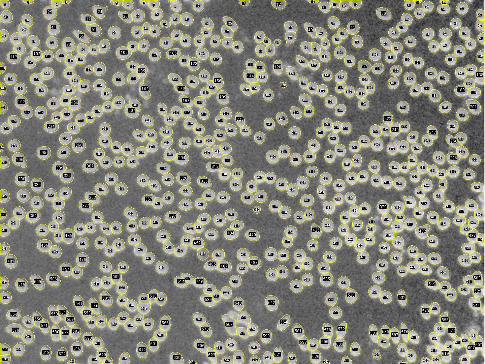
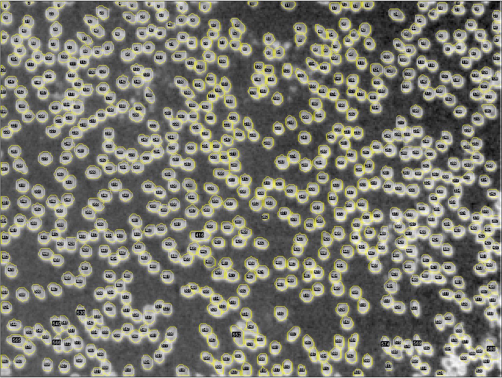

# Multimodal-RBC-Segmentation
Stepwise image resolution reduction and evaluation of multimodal red blood cell segmentation to enhance DL-based malaria diagnostic solutions

# Introduction
Accurate segmentation of red blood cells (RBCs) is a key aspect of Deep Learning-based malaria diagnostics, enabling precise parasite classification and effective spectral analysis. This project explores the impact of image resolution and imaging modalities on segmentation accuracy, aiming to identify a resolution threshold that balances computational efficiency with diagnostic performance.

Using a subset of the Toy2 dataset ([Merdasa et al., 2013](https://doi.org/10.1117/1.JBO.18.3.036002)), captured using a multispectral multimodal microscope ([Brydegaard et al., 2011](https://doi.org/10.1063/1.3660810)), this study systematically reduces image resolutions from *1200x1600* to *60x80* pixels and evaluates the segmentation accuracy of two Cellpose 2.0 models ([Pachitariu et al., 2022](https://doi.org/10.1038/s41592-022-01663-4)). The models are trained on manually annotated ground truth cell masks and assessed using pixel-wise and cell-wise metrics, including Dice Score, Panoptic Quality Score, and F1 Score.

# Segmentation Result
<p align="center">
  <div style="display: inline-block; margin-right: 20px; text-align: center;">
    
    <br />
    <span style="font-size: 12px; color: gray;">Image Resolution 1080x1440, Avg. Diameter Cell: 40.5</span>
  </div>
  <div style="display: inline-block; text-align: center;">
    
    <br />
    <span style="font-size: 12px; color: gray;">Image Resolution 240x320, Avg. Diameter Cell: 9 Pixel</span>
  </div>
</p>

Original Image Credits (without Segmentation Mask): ([Merdasa et al., 2013](https://doi.org/10.1117/1.JBO.18.3.036002))

# Implementation
## Image & Mask Rescaling *resize_tif_png.py*
This Python script is designed to resize TIFF images (supporting 32-bit, 3-channel images) and their corresponding PNG masks to different resolutions, while preserving label integrity (Nearest neighbor interpolation).
- Input
  - Original TIFF image and an optional PNG mask (both with the same image resolution)
  - Scaling factors as a comma-separated list (e.g., 0.9,0.8,0.7)
- Output:
  - Rescaled TIFF images (e.g., original_name_resX_Y.tiff)
  - Rescaled PNG masks (e.g., original_name_resX_Y_masks.png)

Exaple Usage:
Before running the script, install the required dependencies by running:

```bash 
pip install -r requirements.txt
```
Then, execute the script by running the following command:

```bash
python resize_tif_png.py "0.9,0.8,0.7,0.6,0.5,0.4,0.3,0.2,0.1" /path/to/original_image.tiff /path/to/original_mask.png
```
## Training, Evaluation and Testing of Cellpose Segmentation Model
Execute the Three Notebooks in Google Colab

| **Notebook**   | **Description**                                                         | **Code Credits**                                                                                                                                                                                                                                                                                                                                 |
|----------------|-------------------------------------------------------------------------|--------------------------------------------------------------------------------------------------------------------------------------------------------------------------------------------------------------------------------------------------------------------------------------------------------------------------------------------------|
| **train.ipynb** | Training Cellpose model with images and corresponding masks             | - Stringer et al. Base structure: [Cellpose GitHub](https://github.com/MouseLand/cellpose?tab=readme-ov-file), [Cellpose Code](https://colab.research.google.com/github/MouseLand/cellpose/blob/main/notebooks/runcellpose2.ipynb). Accessed: 2024-12-30 <br>- Sreenu, B. N. Python for Microscopists: Cellpose Algorithm for Segmentation. [pythonformicroscopists GitHub](https://github.com/bnsreenu/pythonformicroscopists/blob/master/305WhatisCellposealgorithmforsegmentation.ipynb). Accessed: 2024-12-30 <br>- Remaining authors implementation: `ensure_hw_c_format()`, `calculate_diameter()`, `get_diameter_for_image()`                                                                                                                                 |
| **eval.ipynb**  | Evaluation of Cellpose model using Dice, F1, Panoptic Quality Scores, etc. | - Stringer et al. Base structure: [Cellpose GitHub](https://github.com/MouseLand/cellpose?tab=readme-ov-file), [Cellpose Code](https://colab.research.google.com/github/MouseLand/cellpose/blob/main/notebooks/runcellpose2.ipynb). Accessed: 2024-12-30. <br>- Sreenu, B. N. Python for Microscopists: Cellpose Algorithm for Segmentation. [pythonformicroscopists GitHub](https://github.com/bnsreenu/pythonformicroscopists/blob/master/305WhatisCellposealgorithmforsegmentation.ipynb). Accessed: 2024-12-30. - Functions: writing quality control <br>- Evaluation Metric from Stardist Matching Implementation: "StarDist: Matching Implementation," 2021, [StarDist GitHub](https://github.com/stardist/stardist/blob/main/stardist/matching.py). Accessed: 2024-12-30.<br>- Remaining authors implementation: Adaptation of quality control metrics code (Dice Score etc.), Extension (Dice Score) in stardist/matching.py, `get_diameter_for_image()`, `calculate_dice()`, `calculate_diameter()`, all matplotlib plots in the visualization chapter. |
| **test.ipynb**  | Testing Cellpose model on unknown data                                  | - Stringer et al. Base structure: [Cellpose GitHub](https://github.com/MouseLand/cellpose?tab=readme-ov-file), [Cellpose Code](https://colab.research.google.com/github/MouseLand/cellpose/blob/main/notebooks/runcellpose2.ipynb). Accessed: 2024-12-30. <br>- Remaining authors implementation: dynamic diameter adjustment, `process_images()`, `get_diameter_for_image()`, `calculate_diameter()`, check image dimensions and conversion.                                                                                             |
# References:
1. **Merdasa, Aboma, Mikkel Brydegaard, Sune Svanberg, and Jeremie T. Zoueu.**  
"Staining-free malaria diagnostics by multispectral and multimodality light-emitting-diode microscopy."  
*Journal of Biomedical Optics*, vol. 18, no. 3, 2013, p. 036002.  
DOI: [10.1117/1.JBO.18.3.036002](https://doi.org/10.1117/1.JBO.18.3.036002)

2. **Brydegaard, Mikkel, Aboma Merdasa, Hiran Jayaweera, Jens Ålebring, and Sune Svanberg.**  
"Versatile multispectral microscope based on light emitting diodes."  
*Review of Scientific Instruments*, vol. 82, no. 12, 2011, p. 123106.  
DOI: [10.1063/1.3660810](https://doi.org/10.1063/1.3660810)  
Available at: [https://doi.org/10.1063/1.3660810](https://doi.org/10.1063/1.3660810)

3. **M. Pachitariu and C. Stringer.**  
"Cellpose 2.0: how to train your own model."  
*Nature Methods*, vol. 19, no. 12, pp. 1634–1641, Dec. 2022.  
DOI: [10.1038/s41592-022-01663-4](https://doi.org/10.1038/s41592-022-01663-4)

